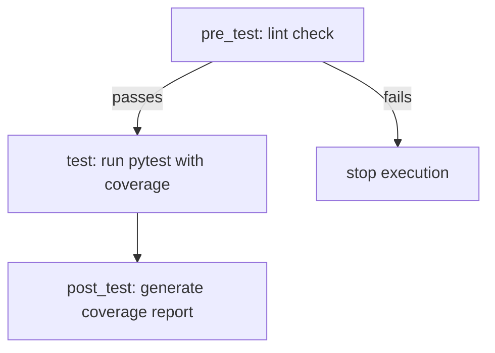

#  FastAPI Python Learning Repository
    
Welcome to the **FastAPI Python Learning Repository** — an interactive project that introduces Python concepts through [FastAPI](https://fastapi.tiangolo.com/), a modern web framework for building APIs with Python 3.7+.

---

##  What Is This?
   
This repository is both:
- A **learning resource** for Python, and  
- A **practical example** of building and serving content via **FastAPI**.

It transforms static educational content about Python into a dynamic API-powered web application.

---

##  Why FastAPI?

FastAPI is:
- ⚡ **Fast**: High-performance, powered by **Starlette** and **Pydantic**.  
- 🧑‍💻 **Beginner-friendly**: Minimal boilerplate, easy to get started.  
- 🔄 **Async-ready**: Native async support for modern Python.  
- 📚 **Well-documented**: Includes automatic Swagger and ReDoc docs.  

---

##  Setup

### 1. Clone the repository
```bash
git clone https://github.com/gil-son/fast-api.git
cd fast-api/
```

### 2. Create a virtual environment
```bash
python3 -m venv venv
```

### 3. Activate the environment
```bash
source venv/bin/activate
```

### 4. Install dependencies
```bash
pip install -r requirements.txt
```

### 5. About dependencies

This project relies on the following Python packages:

- **[fastapi](https://fastapi.tiangolo.com/)** – The core web framework used to build the API. Provides routing, request handling, validation, and automatic documentation (Swagger & ReDoc).
- **[uvicorn](https://www.uvicorn.org/)** – An ASGI server to run FastAPI applications in production or development mode. Required to serve the app.
- **[pytest](https://docs.pytest.org/)** – A testing framework that makes it easy to write and run unit tests for Python applications.
- **[pytest-cov](https://pytest-cov.readthedocs.io/)** – A pytest plugin that generates coverage reports, helping to ensure test completeness.
- **[taskipy](https://github.com/taskipy/taskipy)** – A simple task runner that allows you to define reusable commands (e.g., run, test, lint) in `pyproject.toml`.
- **[ruff](https://github.com/astral-sh/ruff)** – A fast Python linter and code formatter, ensuring code style consistency and catching errors early.
  In this project, Ruff serves two main purposes:  
  - **Static code analyzer (linter):** ensures we are not violating programming best practices.  
  - **Code formatter:** enforces a consistent coding style, based on **PEP-8**.  


Together, these tools support development, testing, linting, formatting, and running the application smoothly.

### 6. Run the app

```
task run
```

You can access on **http://127.0.0.1:8000/**

## 7. API Documentation

FastAPI automatically generates interactive documentation:

- Swagger UI (interactive): **http://127.0.0.1:8000/docs**
- ReDoc (static): **http://127.0.0.1:8000/redoc**

### 8. Understanding `pyproject.toml`


#### Ruff configuration:

```
[tool.ruff]
line-length = 79              # max line length (PEP 8: 80 columns)
extend-exclude = ["migrations"]  # exclude migrations folder
```

#### Configured tasks:

Each task defines a command and its purpose:

```toml
[tool.taskipy.tasks]
lint = "ruff check"                # run static analysis
pre_format = "ruff check --fix"    # auto-fix lint issues
format = "ruff format"             # format code
run = "fastapi dev fast_zero/app.py"   # run the project
pre_test = "task lint"             # lint before tests
test = "pytest -s -x --cov=fast_zero -vv"  # run tests with coverage
post_test = "coverage html"        # generate coverage report
```

- To execute a task, type task followed by the task name. Example:

```
task run
```


- Some tasks are chained in a sequence. For example, when running tests:

```
pre_test = 'task lint'
test = 'pytest -s -x --cov=fast_zero -vv'
post_test = 'coverage html'
```

Here:

- pre_test is always executed first (lint check).
- If it passes, the test command runs.
- Finally, post_test generates the coverage report.




#### Configured linter rules:

This section defines the practices and style checks followed in the project:

```
[tool.ruff.lint]
preview = true
select = ['I', 'F', 'E', 'W', 'PL', 'PT']
```

- I (isort): import sorting
- F (pyflakes): find errors
- E (pycodestyle): style errors
- W (pycodestyle): style warnings
- PL (pylint): pylint errors
- PT (flake8-pytest-style): pytest style violations

---

##  Repository Structure

```
fast-api/
├── fast_zero/
│   └── app.py           # Main FastAPI application
├── README.md            # Project documentation
└── requirements.txt     # Dependencies
```

---

##  References & Resources

- [Dunossauro - FastAPI do Zero](https://fastapidozero.dunossauro.com/estavel/)  
- [FastAPI Official Documentation](https://fastapi.tiangolo.com/)  

---
